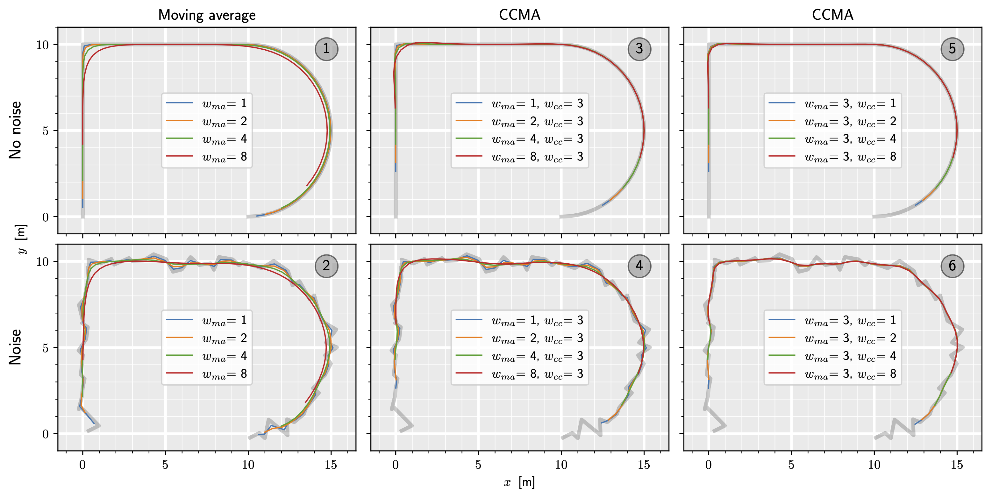

# Curvature Corrected Moving Average (CCMA)

---

The CCMA is a **model-free** filtering technique designed for 2D and 3D paths. It
addresses the issue of the inwards bending phenomenon in curves that commonly occurs with
conventional moving average filters. The CCMA method employs a **symmetric filtering**
However, due to its symmetric approach, it primarily serves as accurate smoothing rather than state estimation.

The implementation includes the ability to filter given points represented as a
numpy array. Additionally, the method supports filtering the boundaries with
decreasing filtering width.

While the code itself may not provide a complete understanding, further details
and insights can be found in the paper:

*T. Steinecker and H.-J. Wuensche, "A Simple and Model-Free Path Filtering
Algorithm for Smoothing and Accuracy", in Proc. IEEE Intelligent Vehicles
Symposium (IV), 2023*



### Minimal Working Example

```python
import numpy as np
from ccma.ccma import CCMA

# Create noisy points on an unit circle
n = 50
noise = np.random.normal(0, 0.05, (n, 2))
points = np.array([np.cos(np.linspace(0, 2*np.pi, n)),
                   np.sin(np.linspace(0, 2*np.pi, n))]).T
noisy_points = points + noise

# Create ccma-object and filter by including the boundaries
ccma = CCMA(w_ma=3, w_cc=3, distrib="normal")
points_filtered = ccma.filter(noisy_points, fill_boundary=True)
```